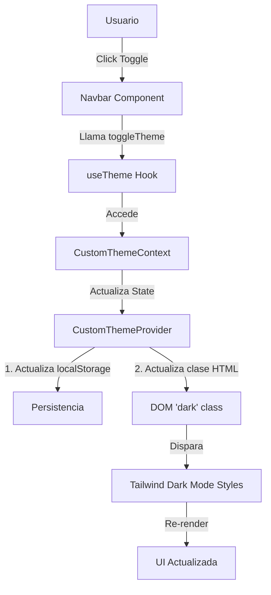

# Documentación Técnica del Software

**Proyecto:** Portafolio Profesional  
**Versión:** 2.0.0  
**Fecha:** Diciembre 2025  
**Autor:** Luis Jhonata Cueva R.

---

## 1. Introducción y Propósito

El sistema consiste en una **Single Page Application (SPA)** destinada a servir como portafolio personal y profesional. Su objetivo principal es presentar de manera estructurada, estética y accesible las habilidades, experiencia laboral, proyectos y medios de contacto del autor.

El software está priorizado para el **rendimiento** (carga rápida), la **mantenibilidad** (arquitectura limpia) y la **escalabilidad** (fácil adición de nuevas secciones).

---

## 2. Especificaciones Técnicas

### 2.1 Stack Tecnológico

| Capa                   | Tecnología                   | Justificación                                                                                 |
| :--------------------- | :--------------------------- | :-------------------------------------------------------------------------------------------- |
| **Frontend Framework** | React 18                     | Ecosistema maduro, manejo eficiente del DOM y componetización.                                |
| **Lenguaje**           | JavaScript (ES6+)            | Estándar de la industria.                                                                     |
| **Bundle Tool**        | Vite                         | Tiempos de arranque instantáneos y Hot Module Replacement (HMR) superior a Webpack.           |
| **Estilos**            | Tailwind CSS v3              | Desarrollo rápido mediante utilidades.                                                        |
| **Metodología CSS**    | BEM (Block Element Modifier) | Organiza las utilidades de Tailwind en clases semánticas para evitar "spaghetti code" en JSX. |
| **Iconos**             | React Icons                  | Carga svg optimizada y bajo demanda.                                                          |
| **Hosting**            | GitHub Pages                 | Despliegue gratuito y automatizado directamente desde el repositorio.                         |

---

## 3. Arquitectura del Sistema

### 3.1 Estructura Lógica

La aplicación sigue una arquitectura basada en **Componentes Funcionales** y **Composición**. No se utiliza una gestión de estado global compleja (como Redux) debido a que la complejidad del estado es baja (limitada al tema UI), lo cual se maneja eficientemente con **React Context**.

### 3.2 Diagrama de Flujo de Datos (Contexto de Tema)



### 3.3 Gestión de Estilos (Clean CSS Architecture)

Se ha implementado una capa de abstracción sobre Tailwind CSS utilizando `@apply` en `index.css`. Esto separa la responsabilidad del **Diseño** (CSS) de la **Estructura** (JSX).

**Patrón aplicado:**

-   **JSX**: Solo define estructura y clases semánticas (ej. `work-card`).
-   **CSS**: Define la composición visual (ej. `.work-card { @apply bg-white rounded-xl ... }`).

---

## 4. Componentes Clave

### 4.1 WorkCard (`src/components/WorkCard.jsx`)

Componente polimórfico encargado de renderizar tarjetas de experiencia.

-   **Props**: `vertical` (bool) controla el layout interno.
-   **Lógica**: Delega toda la variación visual a clases CSS modificadoras (`work-card--vertical` vs `work-card--horizontal`), manteniendo el componente libre de lógica condicional en estilos inline.

### 4.2 Section (`src/components/Section.jsx`)

Wrapper estructural que garantiza consistencia en márgenes, paddings y títulos de sección. Implementa el patrón "Composition" mediante `children`.

### 4.3 CustomThemeProvider

Proveedor de contexto que encapsula la lógica de inicialización del tema (lectura de `localStorage` o preferencia del sistema `prefers-color-scheme`) y la mutación del DOM.

---

## 5. Métricas y Calidad

Para asegurar la calidad del software se establecen los siguientes lineamientos:

1.  **Lighthouse Score**: Mantener puntuación > 90 en Performance, Accessibility, Best Practices y SEO.
2.  **Responsive Design**: Verificación visual en breakpoints móviles (sm: 640px), tablet (md: 768px) y desktop (lg: 1024px).
3.  **Code Splitting**: Uso de importaciones dinámicas si el bundle principal excede los 500kb (actualmente gestionado por Vite).

### 5.1 Estrategia de Carga (Lazy Loading)

Se ha implementado `React.lazy` y `Suspense` para dividir el código de la aplicación.

-   **Componentes Diferidos**: `Skills`, `WorkCard`, `ProjectCard`, `Contact`.
-   **Feedback Visual**: Se utilizan componentes "Skeleton" (`SkeletonWorkCard`, `SkeletonContact`, etc.) que imitan la estructura del contenido mientras se carga el javascript necesario, mejorando la Percepción de Velocidad (Perceived Performance).

---

## 6. Riesgos y Mitigaciones

| Riesgo                                 | Impacto | Mitigación                                                                    |
| :------------------------------------- | :------ | :---------------------------------------------------------------------------- |
| **Colisión de clases CSS**             | Medio   | Uso estricto de metodología BEM para nombres de clases.                       |
| **Performance degradada por imágenes** | Alto    | Uso de formato WebP y atributo `loading="lazy"` en todas las etiquetas `img`. |
| **Fallo en despliegue**                | Medio   | Script `deploy` automatizado que ejecuta `build` antes de publicar.           |

---

## 7. Referencia de API (Props)

### WorkCard

```javascript
WorkCard.propTypes = {
    name: string.isRequired, // Título del proyecto
    role: string, // Rol desempeñado
    description: string, // Descripción breve
    image: string.isRequired, // URL de la imagen
    link: string.isRequired, // URL externa
    tags: arrayOf(string), // Tecnologías usadas
    vertical: bool, // Layout vertical u horizontal
};
```
