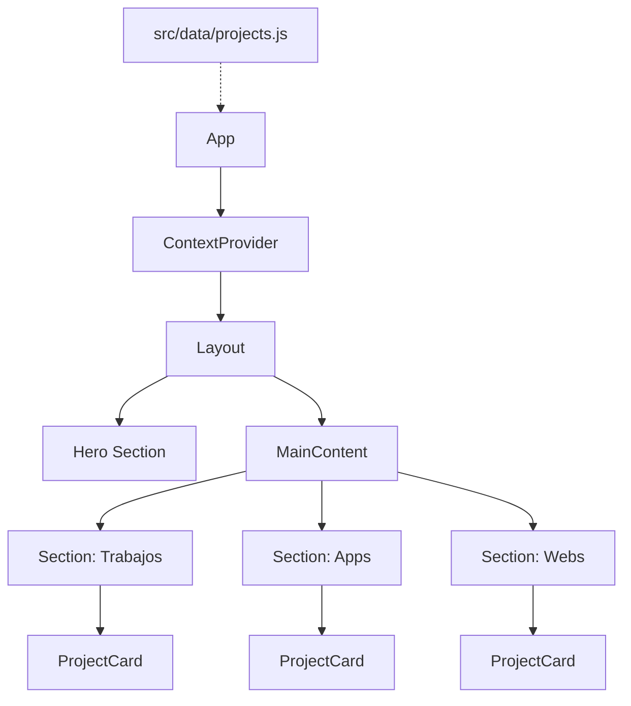

# Documento Técnico de Software

## 1. Visión General
Este documento describe la arquitectura y diseño técnico del portafolio personal "Slinkter". El sistema actúa como una carta de presentación digital interactiva, mostrando habilidades, proyectos y experiencia laboral.

## 2. Requerimientos

### Funcionales
*   **RF01**: Visualización de proyectos destacados con imagen, título y enlace.
*   **RF02**: Filtrado o categorización visual (Trabajos, Apps, Webs).
*   **RF03**: Cambio de tema (Claro/Oscuro) persistente.
*   **RF04**: Descarga de CV.

### No Funcionales
*   **RNF01 - Rendimiento**: Lighthouse Score > 90 en Performance.
*   **RNF02 - Mantenibilidad**: Código modular siguiendo principios SOLID.
*   **RNF03 - Escalabilidad**: Facilidad para agregar nuevas secciones sin duplicar código.

## 3. Arquitectura Lógica

### Diagrama de Componentes (Mermaid)

### Flujo de Datos
El flujo es unidireccional (One-Way Data Flow):
1.  Los datos estáticos se importan en `App.jsx` desde `src/data`.
2.  `App.jsx` pasa estos datos como *props* a los componentes `Section`.
3.  `Section` itera sobre los datos y renderiza `ProjectCard`s individuales.

## 4. Representación del Estado Global
El estado del tema se maneja globalmente mediante React Context API:

*   **Context**: `CustomThemeContext`
*   **Provider**: `CustomThemeProvider`
*   **Hook**: `useTheme()`
*   **Persistencia**: `localStorage`

## 5. Riesgos y Mitigaciones

| Riesgo | Impacto | Mitigación |
| :--- | :--- | :--- |
| Crecimiento descontrolado de datos | Alto (Performance) | Implementar paginación o virtualización si los proyectos superan los 50 items. |
| Inconsistencia de diseño | Medio | Uso estricto de BEM y variables CSS/Tailwind config. |
| Enlaces rotos (Imágenes) | Medio | Implementar un pipeline de validación de assets o usar un CDN robusto. |

## 6. Métricas de Calidad
*   **Complejidad Ciclomática**: Mantener funciones con complejidad < 10.
*   **Duplicación de Código**: 0% en bloques de estructura (resuelto con `<Section />`).
