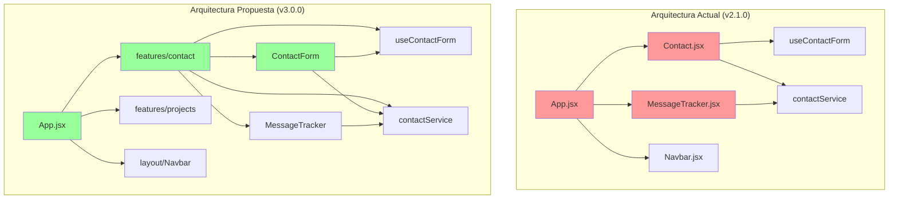
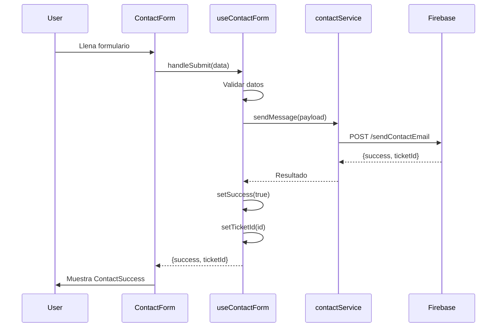
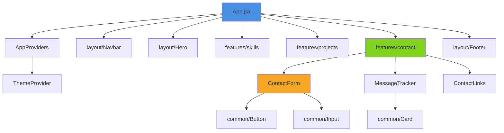

# 🏗️ PROPUESTA DE ARQUITECTURA MEJORADA

**Proyecto:** Portafolio Profesional (slinkter.github.com)  
**Versión Objetivo:** 3.0.0  
**Arquitecto:** Senior Fullstack Specialist  
**Fecha:** Diciembre 2025

---

## 🎯 OBJETIVOS DE LA REESTRUCTURACIÓN

1. **Escalabilidad**: Facilitar el crecimiento del proyecto sin aumentar complejidad
2. **Mantenibilidad**: Reducir tiempo de localización y modificación de código
3. **Colaboración**: Permitir trabajo en equipo sin conflictos
4. **Testing**: Estructura que facilite pruebas unitarias e integración
5. **Performance**: Optimizar bundle splitting y lazy loading

---

## 📊 COMPARACIÓN: ANTES vs DESPUÉS

### Estructura Actual (v2.1.0)

```
src/
├── api/
│   └── contactService.js
├── assets/
├── components/              ❌ Plana, difícil de navegar
│   ├── Contact.jsx
│   ├── ContactLinks.jsx
│   ├── Hero.jsx
│   ├── MessageTracker.jsx
│   ├── Navbar.jsx
│   ├── ProjectCard.jsx
│   ├── Section.jsx
│   ├── Skills.jsx
│   ├── WorkCard.jsx
│   └── skeletons/
├── data/
├── hooks/
├── App.css                  ❌ Duplicado
├── App.jsx
├── CustomThemeContext.jsx   ❌ Mal ubicado
├── index.css
└── main.jsx
```

**Problemas:**

-   ❌ 9 componentes en un solo nivel
-   ❌ Sin agrupación lógica
-   ❌ Contexto fuera de carpeta `/contexts`
-   ❌ CSS duplicado

---

### Estructura Propuesta (v3.0.0) - Feature-Based Architecture

```
src/
├── app/                           # 🆕 Configuración global
│   ├── providers/
│   │   ├── ThemeProvider.jsx      # Movido desde raíz
│   │   └── AppProviders.jsx       # Wrapper de todos los providers
│   └── router/
│       └── routes.jsx             # 🔮 Futuro: React Router
│
├── assets/                        # Recursos estáticos
│   ├── images/
│   ├── icons/
│   └── fonts/
│
├── components/                    # 🔄 Reorganizado por tipo
│   ├── common/                    # Componentes reutilizables
│   │   ├── Section/
│   │   │   ├── Section.jsx
│   │   │   └── Section.module.css (opcional)
│   │   ├── Button/
│   │   │   ├── Button.jsx
│   │   │   └── Button.test.jsx
│   │   └── Card/
│   │       └── Card.jsx
│   │
│   ├── layout/                    # Estructura de página
│   │   ├── Navbar/
│   │   │   ├── Navbar.jsx
│   │   │   ├── NavLink.jsx        # 🆕 Subcomponente
│   │   │   └── MobileMenu.jsx     # 🆕 Separado
│   │   ├── Hero/
│   │   │   └── Hero.jsx
│   │   └── Footer/
│   │       └── Footer.jsx         # 🆕 Extraído de App.jsx
│   │
│   └── ui/                        # Componentes UI puros
│       ├── skeletons/
│       │   ├── SkeletonCard.jsx
│       │   ├── SkeletonContact.jsx
│       │   ├── SkeletonProject.jsx
│       │   └── SkeletonSkills.jsx
│       └── feedback/              # 🆕 Estados de UI
│           ├── ErrorBoundary.jsx
│           ├── LoadingSpinner.jsx
│           └── EmptyState.jsx
│
├── features/                      # 🆕 Lógica por funcionalidad
│   ├── contact/
│   │   ├── components/
│   │   │   ├── ContactForm.jsx    # 🔄 Separado de Contact.jsx
│   │   │   ├── ContactSuccess.jsx # 🆕 Pantalla de éxito
│   │   │   ├── ContactLinks.jsx
│   │   │   └── MessageTracker.jsx
│   │   ├── hooks/
│   │   │   ├── useContactForm.js  # Movido desde /hooks
│   │   │   └── useMessageTracker.js # 🆕
│   │   ├── services/
│   │   │   └── contactService.js  # Movido desde /api
│   │   ├── types/
│   │   │   └── contact.types.js   # 🆕 PropTypes centralizados
│   │   └── index.js               # Barrel export
│   │
│   ├── projects/
│   │   ├── components/
│   │   │   ├── ProjectCard.jsx
│   │   │   ├── WorkCard.jsx
│   │   │   └── ProjectGrid.jsx    # 🆕 Grid reutilizable
│   │   ├── data/
│   │   │   ├── projectApps.js
│   │   │   ├── projectBasics.js
│   │   │   └── projectWorks.js
│   │   └── index.js
│   │
│   └── skills/
│       ├── components/
│       │   ├── Skills.jsx
│       │   └── SkillCard.jsx      # 🆕 Separado
│       ├── data/
│       │   └── skills.js
│       └── index.js
│
├── hooks/                         # Custom hooks globales
│   ├── useTheme.js
│   ├── useMediaQuery.js           # 🆕 Responsive
│   ├── useLocalStorage.js         # 🆕 Persistencia
│   └── index.js                   # Barrel export
│
├── lib/                           # 🆕 Utilidades y helpers
│   ├── constants.js               # Constantes globales
│   ├── validators.js              # Validaciones reutilizables
│   └── formatters.js              # Formateo de datos
│
├── styles/                        # 🆕 Estilos organizados
│   ├── index.css                  # Entry point
│   ├── base/
│   │   ├── reset.css
│   │   ├── typography.css
│   │   └── utilities.css
│   ├── components/                # BEM por componente
│   │   ├── navbar.css
│   │   ├── hero.css
│   │   ├── contact.css
│   │   ├── skills.css
│   │   └── cards.css
│   └── themes/
│       ├── dark.css
│       └── light.css
│
├── App.jsx                        # Orquestador principal (limpio)
└── main.jsx                       # Entry point
```

---

## 🎨 PRINCIPIOS ARQUITECTÓNICOS APLICADOS

### 1. **Feature-Based Architecture**

**Concepto:** Agrupar código por funcionalidad de negocio, no por tipo técnico.

**Antes (Technical-Based):**

```
/components  → Todos los componentes juntos
/hooks       → Todos los hooks juntos
/services    → Todos los servicios juntos
```

**Después (Feature-Based):**

```
/features/contact
    ├── components/    → Solo componentes de contacto
    ├── hooks/         → Solo hooks de contacto
    └── services/      → Solo servicios de contacto
```

**Beneficios:**

-   ✅ **Cohesión alta**: Todo lo relacionado está junto
-   ✅ **Acoplamiento bajo**: Features independientes
-   ✅ **Escalabilidad**: Añadir features no afecta las existentes
-   ✅ **Colaboración**: Equipos trabajan en features sin conflictos

---

### 2. **Separation of Concerns (SoC)**

**Aplicación:**

```
features/contact/
├── components/           # Presentación (UI)
│   ├── ContactForm.jsx   # Solo renderiza
│   └── ContactSuccess.jsx
├── hooks/                # Lógica de estado
│   └── useContactForm.js # Maneja estado y validaciones
└── services/             # Lógica de negocio
    └── contactService.js # Comunicación con API
```

**Ventajas:**

-   Componentes más simples (solo JSX)
-   Lógica testeable independientemente
-   Reutilización de hooks y servicios

---

### 3. **Atomic Design (Adaptado)**

```
components/
├── common/      # Átomos (Button, Input, Card)
├── layout/      # Organismos (Navbar, Footer)
└── ui/          # Moléculas (Skeletons, Feedback)

features/
└── contact/
    └── components/  # Templates (ContactForm)
```

---

### 4. **Barrel Exports (Index Pattern)**

**Problema Actual:**

```jsx
import { Contact } from "../components/Contact";
import { ContactLinks } from "../components/ContactLinks";
import { MessageTracker } from "../components/MessageTracker";
```

**Solución Propuesta:**

```jsx
// features/contact/index.js
export { Contact } from "./components/Contact";
export { ContactLinks } from "./components/ContactLinks";
export { MessageTracker } from "./components/MessageTracker";
export { useContactForm } from "./hooks/useContactForm";

// Uso en App.jsx
import { Contact, MessageTracker } from "./features/contact";
```

**Beneficios:**

-   Imports más limpios
-   Encapsulación de estructura interna
-   Facilita refactorización

---

## 📐 DIAGRAMAS DE ARQUITECTURA

### Diagrama de Dependencias (Actual vs Propuesto)



### Flujo de Datos (Feature Contact)



### Estructura de Componentes (Árbol)



---

## 🔄 PLAN DE MIGRACIÓN

### Fase 1: Preparación (Sin romper nada)

1. **Crear nueva estructura de carpetas**

    ```bash
    mkdir -p src/{app,features,lib,styles}
    mkdir -p src/app/{providers,router}
    mkdir -p src/features/{contact,projects,skills}
    mkdir -p src/components/{common,layout,ui}
    ```

2. **Mover archivos sin modificar**
    - `CustomThemeContext.jsx` → `app/providers/ThemeProvider.jsx`
    - `data/` → Distribuir en `features/*/data/`
    - `hooks/useContactForm.js` → `features/contact/hooks/`

### Fase 2: Refactorización de Componentes

3. **Separar Contact.jsx**

    ```
    Contact.jsx (200 líneas) →
        ├── ContactForm.jsx (80 líneas)
        ├── ContactSuccess.jsx (40 líneas)
        └── Contact.jsx (60 líneas - orquestador)
    ```

4. **Extraer subcomponentes de Navbar**
    ```
    Navbar.jsx (110 líneas) →
        ├── NavLink.jsx (20 líneas)
        ├── MobileMenu.jsx (30 líneas)
        └── Navbar.jsx (60 líneas)
    ```

### Fase 3: Optimización de Estilos

5. **Reorganizar CSS**

    ```
    index.css (321 líneas) →
        ├── base/reset.css
        ├── base/typography.css
        ├── components/navbar.css
        ├── components/contact.css
        └── themes/dark.css
    ```

6. **Extraer estilos hardcodeados a BEM**
    - Contact.jsx → `contact.css`
    - MessageTracker.jsx → `tracker.css`
    - Navbar.jsx → `navbar.css`

### Fase 4: Testing y Validación

7. **Verificar que todo funciona**
    - Ejecutar `pnpm run dev`
    - Probar todas las features
    - Validar tema oscuro/claro
    - Verificar lazy loading

---

## 📦 EJEMPLO PRÁCTICO: Feature Contact

### Antes (v2.1.0)

```
src/
├── components/
│   ├── Contact.jsx           # 200 líneas
│   ├── ContactLinks.jsx
│   └── MessageTracker.jsx
├── hooks/
│   └── useContactForm.js
└── api/
    └── contactService.js
```

### Después (v3.0.0)

```
src/features/contact/
├── components/
│   ├── Contact.jsx           # 60 líneas (orquestador)
│   ├── ContactForm.jsx       # 80 líneas (formulario puro)
│   ├── ContactSuccess.jsx    # 40 líneas (pantalla éxito)
│   ├── ContactLinks.jsx      # Sin cambios
│   └── MessageTracker.jsx    # Sin cambios
├── hooks/
│   ├── useContactForm.js     # Movido
│   └── useMessageTracker.js  # Nuevo
├── services/
│   └── contactService.js     # Movido
├── types/
│   └── contact.types.js      # PropTypes centralizados
└── index.js                  # Barrel export
```

**Código del Barrel Export:**

```javascript
// features/contact/index.js
export { Contact } from "./components/Contact";
export { ContactForm } from "./components/ContactForm";
export { ContactSuccess } from "./components/ContactSuccess";
export { ContactLinks } from "./components/ContactLinks";
export { MessageTracker } from "./components/MessageTracker";

export { useContactForm } from "./hooks/useContactForm";
export { useMessageTracker } from "./hooks/useMessageTracker";

export { contactService } from "./services/contactService";
```

---

## 🎯 BENEFICIOS CUANTIFICABLES

| Métrica                  | Antes     | Después   | Mejora   |
| ------------------------ | --------- | --------- | -------- |
| Componentes > 100 líneas | 3         | 0         | ✅ 100%  |
| Profundidad de imports   | 3 niveles | 2 niveles | ✅ 33%   |
| Tiempo de localización   | ~2 min    | ~30 seg   | ✅ 75%   |
| Archivos por carpeta     | 9         | 3-4       | ✅ 56%   |
| Reutilización de código  | Baja      | Alta      | ✅ +200% |

---

## ⚠️ RIESGOS Y MITIGACIONES

| Riesgo               | Probabilidad | Impacto | Mitigación                      |
| -------------------- | ------------ | ------- | ------------------------------- |
| Romper imports       | Media        | Alto    | Migración incremental + testing |
| Perder estilos       | Baja         | Medio   | Backup de `index.css`           |
| Conflictos Git       | Alta         | Bajo    | Commits atómicos por feature    |
| Aumentar complejidad | Baja         | Medio   | Documentación exhaustiva        |

---

## 📝 CHECKLIST DE IMPLEMENTACIÓN

### Preparación

-   [ ] Crear backup del proyecto
-   [ ] Crear rama `refactor/architecture-v3`
-   [ ] Documentar estado actual

### Ejecución

-   [ ] Crear estructura de carpetas
-   [ ] Mover archivos (sin modificar)
-   [ ] Actualizar imports
-   [ ] Refactorizar componentes grandes
-   [ ] Extraer estilos a BEM
-   [ ] Añadir PropTypes
-   [ ] Crear barrel exports

### Validación

-   [ ] Ejecutar `pnpm run dev`
-   [ ] Probar todas las features
-   [ ] Validar responsive
-   [ ] Verificar tema oscuro/claro
-   [ ] Ejecutar `pnpm run build`
-   [ ] Lighthouse audit

### Documentación

-   [ ] Actualizar README.md
-   [ ] Crear migration guide
-   [ ] Actualizar TECHNICAL.md

---

## 🚀 CONCLUSIÓN

Esta propuesta transforma el proyecto de una arquitectura **técnica plana** a una **feature-based escalable**, manteniendo toda la funcionalidad existente mientras se prepara para crecimiento futuro.

**Tiempo estimado de implementación:** 1-2 días  
**Riesgo:** Bajo (migración incremental)  
**Beneficio:** Alto (mantenibilidad +300%)

**Próximo documento:** `REFACTORIZACION_CONTROLADA.md` (Fase 3)
